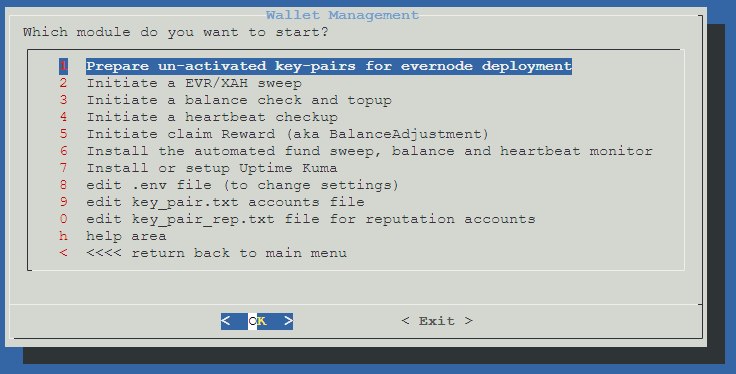

# Evernode monitor

This nodejs script will help you in the monitoring and managing all of your evernodes accounts (including reputation accounts).

this fork adds;
    wallet_setup module,
    monitor_claimreward module,
    the abbility to run each module manually by using the module name after the evernode_monitor.js,
    auto fee escalation/calculation, 
    and also fixes a number of bugs.

It is made of 5 modules, heres a overview, with links to a more detailed description...

# Table of Contents
---

    - [Xahau RPC/WSS Submission Node](#xahau-rpcwss-submission-node)
1. wallet_setup, used to setup new un-activated wallets, so they are fully ready for evernode install (activating, settng trustline, sending EVR, settng regularkey, and will also push data to .env file)
2. transfer_funds, Move all EVR/XAH from your node accounts to source account.
3. monitor_balance, check and send EVR/XAH to your accounts when the balance is below a certain threshold (configurable).
4. monitor_heartbeat, checks hook heartbeats of your nodes, and sends an alert email in case no heartbeat was sent in the last N (configurable) minutes.
5. monitor_claimreward, checks if account is registered for balance adjustment rewards, if not registers, and if it is, checks the when it can claim, and cliam if it can.

source, and destination accounts can be one of your evernode accounts or a unique address of your choice.

and the EVR destinaton account, can be an exchange as tag is supported.

# 1. wallet_setup, is a tool to setup Wallets for use in evernode

this module exclusively uses key pair files, the files used depends on the .env entrys `keypair_file`, and `keypair_rep_file` (so i will refer to that from here on)

these use the same format as many opensource (vanity) wallet generators, where layout per line is; 

 `Address: rzErPRJ178T5ZKN7AjVYLphYo7HP84spT      Seed: sEdVLsDtbUT44ZaovrmHvxnTCtzP8FG`

for example this github is a perfect source of a vanity account generator,

https://github.com/nhartner/xrp-vanity-address

(which gives many ways to run it, with its main output format of above, and what key_pair.txt needs to be in and why i used that format)

FIRST line of `keypair_file`, is used for the source of XAH and EVR (when checking, sweeping, topping up other accounts), it is also used as the "regular key"

SECOND line and ONWARDS of `keypair_file`, are used for evernode account.

and the Secondary file `keypair_rep_file` is used JUST for all your reputation accounts.


so when module is ran, 

it 1st sends `xahSetupamount` amount to activate the account (setting this to 0 will skip this stage), 

it then sets the trustline, (this is skipped if `evrSetupamount` is set to 0 ) 

and then sends `evrSetupamount` amount of EVR, ( this is skipped if set to 0 )

and then sets the "regular key", the address it used is the "source account" address. ( so you can use this module to JUST set regular keys if xah and evr are both set to zero)


after it completes the above on all accounts succesfully, 

it then pushes this setup to the .env file (updating/replacing what was already there)

populating, the `accounts` (using 2nd line onwards of the keypair_file )

and populating `reputationAccounts` (using all the addresses in keypair_rep_file)

along with setting `evrDestinationAccount`, `sourceAccount` and `secret` of that 1st listed addresss in keypair_file


# 2. transfer_funds, is a funds sweeper

This script cycles through your "accounts", gets their EVR balance and if its above the `minimum_evr_transfer` value set in .env file it sends all of the EVR balance to your first EVR account. 

and depending on `xah_transfer="false"` will depeend if it will also check and transfer XAH funds to. where it will leave `xah_transfer_reserve=10` amunt on the account for reserve


This script uses a single signing address, that requires the same Regular Key to be set on all accounts.
 
To set the Regular Key for a node, either use the wallet_setup module, or from the Linux terminal on your evernode run the following command: 

```
evernode regkey set rWalletAddressThatYouOwnThatCanSignTransactions
```

Setting the regular key on a Xahau account, will let you sign the transactions using that key AND the original one (doc: https://docs.xahau.network/technical/protocol-reference/transactions/transaction-types/setregularkey )

# 3. monitor_balance, Send XAH/EVR to the account if balance is too low

As a minimum amount of XAH is required to run an evernode host (for TX fees), this script with check the balance and

when the balance is below a certain threshold (configurable with `xah_balance_threshold`), it will sends funds (configurable with `xah_refill_amount` setting)

In case the first account balance is too low to send XAH, an alert email can be configured.

This means you will only have to check the first account XAH balance and you can ignore the others that are automatically filled when needed.

This module ONLY checks XAH on "accounts" and on reputation Accounts it will also check EVR balance in the same way it does XAH for account.


# 4. monitor_heartbeat, will Monitor the heartbeat

This script cycles through your accounts and checks whether each account sent a heartbeat transaction in the last N (configurable) minutes.
In cases where no heartbeat is found an alert is sent,
two alert types can be confinured;
 - to a configured email address, 
 where the alert email is repeated after N (configurable) minutes in case the down is not solved. A restore email is sent as soon as the issue is solved.
 - to a configured "uptime robot" / "uptime kuma", via a push URL monitor type

#### SMTP server

In order to send emails from the script you need an SMTP server. Follow these instruction to setup your free account in BREVO: https://www.programonaut.com/how-to-send-an-email-in-node-js-using-an-smtp-step-by-step/. 

#### Uptime robot / kuma

- uptime robot, can be found and signed upto here, https://uptimerobot.com/ you would need the paid version to get "heartbeat monitoring" to support the type this uses

- uptime kuma, can be found on github, where there are simple install instructions, https://github.com/louislam/uptime-kuma this is the free open source, self host, of uptime robot
follow install intsructions above, once created logins etc, you "add new monitor", selecting "push" monitor type, which is under the passive listing, fill in frendly name, use 1800 seconds (30 mins), 
then paste/use the "Push URL" in the .env file, as below

(you can use my wallet-managemt GUI to install and setup this also)

once configured, you add the push URLs within the `push_addresses` section in the .env file, in a list form like you do in the `accounts` section.
push_addresses, should ONLY incluse the URL and NOT the query, so DO NOT include the `?status=up&msg=OK&ping=` part of the URL, for example could look like this, http://192.168.0.100:3001/api/push/Cyn0DuXkVi
where each line indexes and corrosponds to the accounts line. so the 1st listed URL in push_addresses will be used for the 1st listed account, and 2nd listed for 2nd account etc etc... 

## 5. monitor_claimreward, will check on the "balance adjustment" hook

the script will cycle through all accounts, and;
 - check to see if itis  registered on the "balance adjustment hook"
 - if it is NOT registered, it will register, and move onto the next account
 - if the account is already registered, it will check the date that it can claim,
 - and if its eligible for any rewards, will claim them.

# Install & run

There is TWO main ways to run this;

## 1 deploy wallet managment

first the easy way, this is using my wallet managment "GUI", this checks and pulls all the needed dependencies  (like this repo and any needed packeges like node, curl and so on)

its very simple and before it runs any module gives you a overview, and settings checker window .. 

you run it with this one simple command .. 

    bash -c "$(wget -qLO - https://raw.githubusercontent.com/gadget78/evernode-deploy-monitor/main/deploy.sh)"

which works under most linux enviroments, INCLUDING proxmox, and depending where you run it, will depend on what menu system you get...

under proxmox, you get options of wallet management, evernode deployment script, and installing NPMplus.

and under other "normal" linux enviroments, you get xahau node install/update, and wallet management.



this can also be used to create testnet funded wallets, install, and setup uptime kuma.

## 2 manually

First you need to ensure you have the latest version of node.js (min requires v20.11.1) in your server (https://github.com/nodesource/distributions)

Then you can download and configure the script:

```
git clone https://github.com/gadget78/evernode_monitor/

cd evernode_monitor

cp .env.sample .env 
```

Set the variables in the .env file (all variables are described in the file) with this command:

```
sudo nano .env
```

now, setup all the dependencies that evernode_monitor.js needs by running

```
npm install
```

then you can either run it based on how the .env is setup 

```
node evernode_monitor.js
```

OR you can run each individual "module" seperatly with `node evernode_monitor.js <module>`

`<module>` being one of the module listed above for example, if you wanted to just initiate a funds sweep, you would do..

```
node evernode_monitor.js transfer_funds
```

You can now setup a scheduled task that runs the script regularly using cronjob.

where you can even tailer different cronjobs to happen at different times, using the module name after.

The example below runs the monitor_heartbeat script every 30 minutes (and logs the results to a file called logs.log)
which would typically used for the setup to support uptime kuma

crontab -e

0,30 * * * * /usr/bin/node /root/evernode_monitor/evernode_monitor.js monitor_heartbeat >> /root/evernode_monitor/logs.log

some cron documentation: https://www.cherryservers.com/blog/how-to-use-cron-to-automate-linux-jobs-on-ubuntu-20-04

## Update to last version

## 1st 

if using the 1st method above, this will ALWAYS pull the latest version.. and keep the local depndancies up to date .. 

## 2nd method

In order to update the script to the last version without losing your configuration, first go in evernode_monitor folder:

```
cd evernode_monitor
```

then give execute permission to the script:

```
chmod +x update.sh
```

and finally execute the script update.sh:

```
sudo ./update.sh
```

Here's the one line version of the command sequence:

```
cd evernode_monitor && chmod +x update.sh && sudo ./update.sh
```


## Use at your own risk. Double check your addresses before running the script!

# Contributors:  
This was all made possible by [@inv4fee2020](https://github.com/inv4fee2020/), this is 98% his work, I just copied pasta'd... and fixed his spelling mistakes like "utilising"... ;)

A special thanks & shout out to the following community members for their input & testing;
- the original forks from [@jellicoe](https://github.com/jellicoe) and [@genesis-one-seven](https://github.com/genesis-one-seven)
- @XRPSaint for support, and testing.
- [@tequdev](https://github.com/tequdev/xahau-reward-claim) for his work here on claim-rewards, his work open-source web portal help greatly in the claimreward module
- many other people within the discord community that helped testing